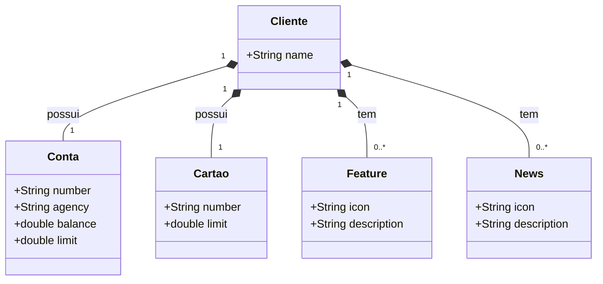

# Criando um API RestFul com Spring

### Diagrama de classe usado representação das classes do projeto:

```mermaid
classDiagram
    title Diagrama de Classes a partir do JSON

    class Cliente {
        +String name
    }

    class Conta {
        +String number
        +String agency
        +double balance
        +double limit
    }

    class Cartao {
        +String number
        +double limit
    }

    class Feature {
        +String icon
        +String description
    }

    class News {
        +String icon
        +String description
    }

    Cliente "1" *-- "1" Conta : possui
    Cliente "1" *-- "1" Cartao : possui
    Cliente "1" *-- "0..*" Feature : tem
    Cliente "1" *-- "0..*" News : tem
```
